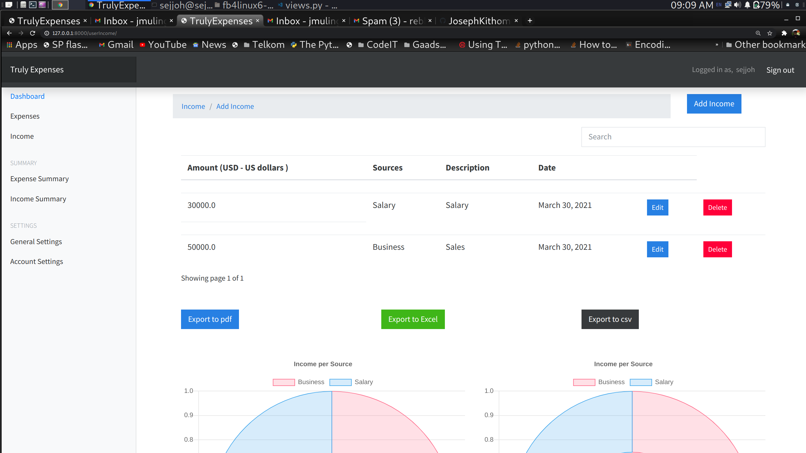

# Income-Expenditure-Tracker

A modern web application to efficiently track and visualize your income and expenses.  
Easily record transactions, review analytics, and manage your personal finance on a secure and user-friendly dashboard.
This project is an Income-Expenditure-Tracker, which is a web application that allows users to track their income and expenses. The project is hosted on GitHub and is publicly available.

### Main Function Points
- Allows users to track their income and expenses
- Provides a user interface for adding, editing, and deleting income and expense entries
- Stores user data in a database
- Provides user authentication and preferences management

### Technology Stack
- Python
- Django (web framework)
- HTML, CSS, JavaScript (front-end)
- SQLite (database)

### License
The project does not specify a license, so the default copyright applies.


The system combines Django's robust backend capabilities with responsive frontend components, using HTML/CSS/JavaScript for dynamic visualizations. While currently using SQLite, the architecture supports potential migration to PostgreSQL/MySQL.

---

## 📸 Screenshots

| Overview                                   | Add Entry                                   | Manage Entries                                |
|---------------------------------------------|---------------------------------------------|-----------------------------------------------|
|  |  |  |

| Analytics                                   | User Profile                                | Admin Dashboard                               |
|---------------------------------------------|---------------------------------------------|-----------------------------------------------|
|  |  |  |

---

## 🚀 Key Features

Here's a merged and enhanced feature overview of the Income-Expenditure-Tracker:

**Core Features**  
1. **Dual Financial Tracking**  
   - Unified interface for recording both income & expenses  
   - Customizable transaction categories with tagging system  
   - Historical transaction timeline with search/filter capabilities  

2. **Comprehensive Data Management**  
   - Full CRUD operations (Create/Read/Update/Delete entries)  
   - Bulk data handling through CSV/Excel import/export  
   - Automatic data validation (currency formats, date parsing)  
   - SQLite database with daily backups  

3. **User Security System**  
   - Email-based authentication with password recovery  
   - Session management with auto-logout  
   - Role-based access control (User/Admin tiers)  
   - Encrypted sensitive data storage  

4. **Advanced Analytics**  
   - Interactive pie/bar charts for expense categorization  
   - Comparative income-expense ratio displays  
   - Customizable reporting periods (day/week/month/year)  
   - Trend prediction based on historical patterns  

5. **Administration Tools**  
   - Django admin dashboard for user management  
   - System-wide transaction audit trails  
   - Export-ready financial reports (PDF/CSV formats)  

---

## 🛠️ Technology Stack

- **Backend:** Python, Django
- **Frontend:** HTML, CSS, JavaScript
- **Database:** SQLite (can be upgraded for production)

---

## ⚡ Quick Start

1. **Clone the Repository:**
   ```bash
   git clone https://github.com/JosephKithome/Income-Expenditure-Tracker.git
   cd Income-Expenditure-Tracker
   ```

2. **Install Dependencies:**
   ```bash
   pip install -r requirements.txt
   ```

3. **Apply Migrations & Run Server:**
   ```bash
   python manage.py migrate
   python manage.py runserver
   ```

4. **Access the App:**  
   Open [http://localhost:8000](http://localhost:8000) in your browser.

---

## 📄 License

_This project does not specify a license. All rights reserved by the author._

---

*For more details, feature requests, or bug reports, please create an issue or pull request in this repository.*
